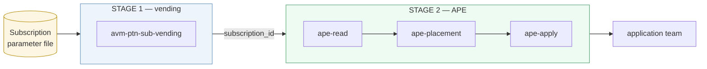

# Azure Placement Engine

*(name is a placeholder)*

Layers quota and capacity decisions onto **Azure subscription vending**.

A vending module builds the subscription as normal. APE then reads the intake
that drove it and sets the subscription up to actually run something: allocating
vCPU quota, choosing a VM family when the customer has not fixed one, and
enforcing the platform team's business rules about who gets what.

It runs as a **second stage** after vending, taking the new `subscription_id` as
its only handoff. Microsoft's [subscription vending
guidance](https://learn.microsoft.com/en-us/azure/architecture/landing-zones/subscription-vending)
lists the deployment pipeline's tasks as Identity, Governance, Networking,
Budgets and Reporting — quota is not among them, and CAF names the gap without
filling it: *"the quota request can fail, so you should run a script to handle
any errors."*

Two paths, one set of answers:

| | read | decide | apply |
|---|---|---|---|
| **Terraform** | `modules/ape-read` | `modules/ape-placement` | `modules/ape-apply` |
| **Bicep** | `powershell/ApeRead.psm1` | `powershell/ApePlacement.psm1` | `bicep/ape-apply.bicep` |

Bicep cannot read quota state, so on that path PowerShell reads and decides and
Bicep only writes. The decision logic therefore exists twice, and
[`conformance/`](conformance/) is what stops the two drifting — one set of
scenarios both must pass.

Built as **Terraform and Bicep (AVM) modules**, composed with
[`Azure/avm-ptn-sub-vending/azurerm`](https://registry.terraform.io/modules/Azure/avm-ptn-sub-vending/azurerm/latest)
and [`avm/ptn/lz/sub-vending`](https://github.com/Azure/bicep-registry-modules/tree/main/avm/ptn/lz/sub-vending).
Neither does anything with quota today, which is the gap this fills.
(`Azure/lz-vending/azurerm` is archived — it migrated to the AVM module above.)
There is no service and no state of its own — Azure's own APIs are the source of
truth, and the modules read, decide, and write.

**[Read the manual](docs/GUIDE.md)** — how to run it, what the answers mean,
where it slots into vending, and the GitHub Actions to wire it up.

## Status

Read, decide and apply are built and working against live subscriptions, in both
Terraform and Bicep. A previous Python implementation ranked regions and
recommended placements for a human to act on; it is superseded and not
published.

- [x] `ape-placement` — decides. 47 tests, no subscription needed
- [x] `ape-read` — live quota, SKU availability and region access, all Terraform
- [x] `ape-apply` — write quota, with the refusal semantics documented
- [x] `examples/vending-stage-2` — the handoff contract and a sample intake
- [x] Bicep path — PowerShell read/decide, `ape-apply.bicep` write, 23 shared scenarios

## Shape

Three layers, deliberately kept distinct:

| Layer | Azure resource | What it is |
|---|---|---|
| **Quota pool** | `Microsoft.Quota/groupQuotas` | The right to ask. Costs nothing, guarantees nothing. Allocating from the group to a subscription is fast; raising the group limit is not. |
| **Capacity buffer** *(later)* | `Microsoft.Compute/capacityReservationGroups` | Held, guaranteed hardware. Costs money while idle. Declared by the customer, not sized by the tool. |
| **Vended subscription** | | The consumer. |

The pool stack owns the allocation table; vending stacks only read it. A
**rebalance** — harvesting quota that member subscriptions hold but do not use,
and redistributing it — is not a separate lifecycle, it is what the pool stack
does when applied with updated floors and demands.

The decision module holds **no resources** — inputs to outputs, so it is testable
with fixtures and no subscription. Reading pool state, deciding, and writing are
separate concerns.

## Scope

**v1 is quota only.** The capacity buffer is a second layer, deferred until the
first is proven — it depends on a preview feature, and a capacity reservation
binds to an exact VM size, which makes it a poor fit for the flexible-intake case
that is most of the value.

The quota backend is swappable: per-subscription `Microsoft.Quota` works today
and is testable on an ordinary subscription, while quota groups change where the
headroom comes from rather than how the decision is made.

## Layout

| Path | What |
|---|---|
| `modules/ape-read/` | Reads live Azure state — quota, SKUs, region access |
| `modules/ape-placement/` | Decides. No resources, so it tests against fixtures |
| `modules/ape-apply/` | Writes the quota a decision asked for |
| `powershell/` | The same read and decide, for the Bicep path |
| `bicep/` | `ape-apply.bicep` — the Bicep half of the Bicep path |
| `conformance/` | One set of scenarios both implementations must pass |
| `docs/GUIDE.md` | The manual |
| `.github/workflows/` | Conformance, and stage 2 for both paths |
| `examples/vending-stage-2/` | The stage-2 pattern, with a sample intake |
| `knowledge/` | Curated facts no API returns — dated and sourced |

## Known constraints

Verified against Microsoft docs, September 2026:

- Quota groups require an **EA, MCA, or Internal** billing account, cover **IaaS
  compute only**, and need `GroupQuota Request Operator` on the management group.
  A subscription can belong to **one quota group at a time**.
- Shared capacity reservation groups are **Preview**, cap at **100 consumer
  subscriptions**, and require the VM to match reservation size, region and zone
  exactly.
- Logical availability zones map differently per subscription, so deploying into
  a shared zonal reservation requires remapping or it fails.
- A shared reservation holds quota **twice** — once in the provider subscription
  for the reservation, once in the consumer subscription for the VMs.
