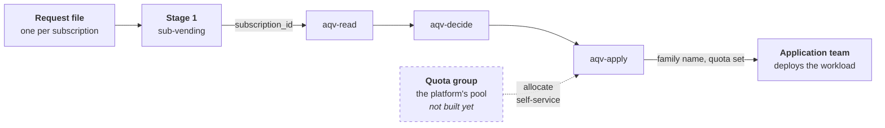

# Azure Quota Vending

> [!WARNING]
> **Experimental. Not ready for use.**
>
> This is an active experiment, not a supported product. The module contracts
> change without notice. It writes real quota to real subscriptions. Do not run
> it against anything you care about.
>
> The quota group and capacity reservation layers are designed but not built,
> and are untested against the billing account types that support them.

Sets the vCPU quota on a newly vended Azure subscription, and tells the
application team which VM family to use.

## What it does

A subscription vending module creates a subscription. That subscription arrives
with Azure's default quota, which is often zero for the family the workload
needs. AQV runs next and does three things:

1. **Reads** the subscription's quota, the VM sizes Azure will let it deploy,
   and whether it has access to the region and the zones.
2. **Decides** which VM family fits the request, and what the quota limit must
   be to run the requested number of vCPUs.
3. **Writes** that quota limit.

It returns the chosen family, the quota it set, and the reason every other
family was rejected.

### Where the quota is meant to come from

A **quota group** — `Microsoft.Quota/groupQuotas` — is a pool the platform
holds, and allocating from it to a subscription is self-service. That is the
point of this project: vending draws down a pool the platform already owns,
rather than asking Azure for more at the moment a workload needs it.

**The quota group layer is not built.** Until it is, AQV reads, decides and
reports, and writes the regional cap when that is what binds. It does not raise
per-subscription family limits, and it is not meant to: a family is only chosen
when its existing quota, or a pool behind it, already covers the request.

On a subscription with no quota group, that means an ask above the current limit
comes back `infeasible` rather than becoming a support request. See
[Not built yet](#not-built-yet).

## What it does not do

**AQV does not deploy anything.** It creates no virtual machine, no scale set
and no disk. The application team deploys the workload, in their own pipeline,
after the subscription is handed over.

AQV's output is an input to that: the application team is told which family to
deploy into, and the subscription already has the quota for it.

## Why

Without this step, the application team finds out at deploy time. The family
they picked has no quota in that region. Or the subscription was never granted
the region. Or the series is one of the thirty that new subscriptions can no
longer deploy at all. Each of those surfaces as a failed deployment, days or
weeks after the subscription was handed over.

AQV moves that discovery to vending time. When the request can be satisfied, it
sets the quota and names the family. When it cannot, it says which gate failed
and what would lift it.

## Where it fits

It runs as a **second stage** after vending, taking the new `subscription_id` as
its only handoff. Microsoft's [subscription vending
guidance](https://learn.microsoft.com/en-us/azure/architecture/landing-zones/subscription-vending)
lists five deployment tasks: identity, governance, networking, budgets and
reporting. Quota is not one of them. The Cloud Adoption Framework states the
problem but does not solve it: *"the quota request can fail, so you should run a
script to handle any errors."*

The dashed box is where the quota is meant to come from and is **not built
yet**. Today `aqv-apply` writes the regional cap and nothing else. See
[Where the quota is meant to come from](#where-the-quota-is-meant-to-come-from).

Two paths, one set of answers:

| | read | decide | apply |
|---|---|---|---|
| **Terraform** | `modules/aqv-read` | `modules/aqv-decide` | `modules/aqv-apply` |
| **Bicep** | `powershell/AqvRead.psm1` | `powershell/AqvDecide.psm1` | `bicep/aqv-apply.bicep` |

Bicep cannot read quota state, so on that path PowerShell reads and decides and
Bicep only writes. The decision logic therefore exists twice, and
[`conformance/`](conformance/) is what stops the two drifting — one set of
scenarios both must pass.

Built as Terraform and Bicep (AVM) modules. It composes with
[`Azure/avm-ptn-sub-vending/azurerm`](https://registry.terraform.io/modules/Azure/avm-ptn-sub-vending/azurerm/latest)
and [`avm/ptn/lz/sub-vending`](https://github.com/Azure/bicep-registry-modules/tree/main/avm/ptn/lz/sub-vending).
Neither of those handles quota. That is the gap AQV fills.

AQV has no service and no state of its own. Azure's APIs are the source of
truth. The modules read, decide and write.

**[Read the manual](docs/GUIDE.md)** — how to run it, what the answers mean,
where it slots into vending, and the GitHub Actions to wire it up.

## Status

Read, decide and apply are built and working against live subscriptions, in both
Terraform and Bicep. A previous Python implementation ranked regions and
recommended placements for a human to act on; it is superseded and not
published.

- [x] `aqv-decide` — decides. 47 tests, no subscription needed
- [x] `aqv-read` — live quota, SKU availability and region access, all Terraform
- [x] `aqv-apply` — write quota, with the refusal semantics documented
- [x] `examples/vending-stage-2` — the handoff contract and a sample request
- [x] Bicep path — PowerShell read/decide, `aqv-apply.bicep` write, 25 shared scenarios

## Design

The decision module holds **no resources**. It takes state in and returns a
decision. That is why the whole decision surface is testable with fixtures and
no subscription, and why the same logic can be implemented twice and held to one
set of answers.

Reading, deciding and writing are three separate modules for the same reason.

### Not built yet

Two layers are designed and recorded in [`knowledge/`](knowledge/), but are not
implemented. Neither can be exercised on an ordinary subscription.

| Layer | Azure resource | What it would add |
|---|---|---|
| Quota group | `Microsoft.Quota/groupQuotas` | A platform-wide quota reserve. Allocating from it to a subscription is self-service and fast. Raising the group's own limit is not. Requires an EA, MCA-Enterprise or Internal billing account. |
| Capacity reservation | `Microsoft.Compute/capacityReservationGroups` | Guaranteed hardware, held in advance. Costs money while idle and binds to one exact VM size. |

The quota group is the goal, not a nice-to-have. The contract for it is already
in place: set `available` on a family and that family becomes a candidate even
when its own limit is short, and the decision returns `needs_allocation`.
Allocating from a group succeeds, where a per-subscription increase is evaluated
and can be refused.

Testing it needs an EA, MCA-Enterprise or Internal billing account. Until then
`available` is null everywhere, so nothing is ever allocatable and the
`needs_allocation` path never runs outside the conformance scenarios.

## Layout

| Path | What |
|---|---|
| `modules/aqv-read/` | Reads live Azure state — quota, SKUs, region access |
| `modules/aqv-decide/` | Decides. No resources, so it tests against fixtures |
| `modules/aqv-apply/` | Writes the quota a decision asked for |
| `powershell/` | The same read and decide, for the Bicep path |
| `bicep/` | `aqv-apply.bicep` — the Bicep half of the Bicep path |
| `conformance/` | One set of scenarios both implementations must pass |
| `docs/GUIDE.md` | The manual |
| `.github/workflows/` | Conformance, and stage 2 for both paths |
| `examples/vending-stage-2/` | The stage-2 pattern, with a sample request |
| `examples/what-can-i-deploy/` | For application teams. Terraform or PowerShell, read-only, needs only Reader |
| `knowledge/` | Curated facts no API returns — dated and sourced |
| `collector/` | A GitHub Copilot agent a partner runs to collect quota group behaviour AQV cannot test |

## Known constraints

Verified against Microsoft docs, September 2026:

- Quota groups require an **EA, MCA, or Internal** billing account, cover **IaaS
  compute only**, and need `GroupQuota Request Operator` on the management group.
  A subscription can belong to **one quota group at a time**.
- Shared capacity reservation groups are **Preview**, cap at **100 consumer
  subscriptions**, and require the VM to match reservation size, region and zone
  exactly.
- Logical availability zones map differently per subscription, so deploying into
  a shared zonal reservation requires remapping or it fails.
- A shared reservation holds quota **twice** — once in the provider subscription
  for the reservation, once in the consumer subscription for the VMs.
