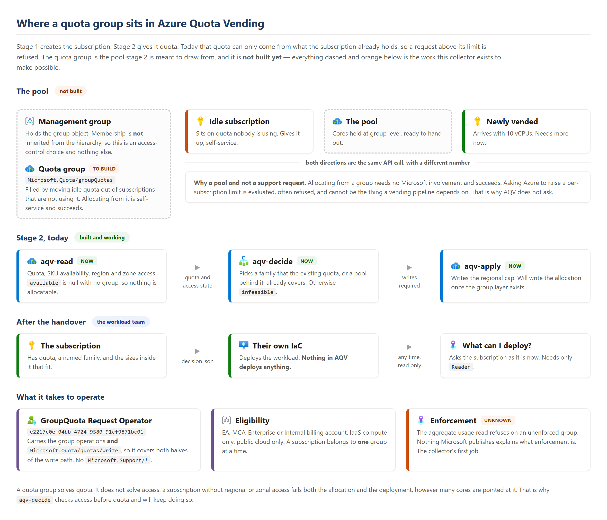
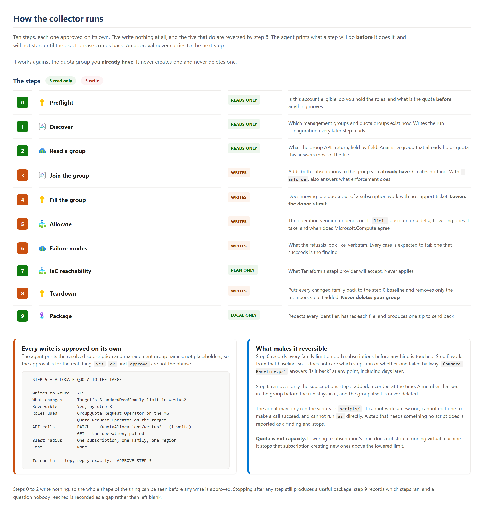

# AQV Quota Group Collector

A GitHub Copilot agent that collects what Azure Quota Groups actually do, on a
billing account that can use them.

**You need this if:** you have an **EA, MCA-Enterprise or Internal** billing
account and you have agreed to run a set of quota experiments for the Azure
Quota Vending project.

**It produces:** a package of captured API calls, timings and error shapes that
[AQV](../README.md) needs to build its quota group layer.

<p align="left">
  
</p>

---

## Why a partner has to run it

Azure Quota Groups require an EA, MCA-Enterprise or Internal billing account.
Pay-as-you-go and personal accounts cannot use one.

**Reads work without an eligible account.** The maintainers have already read a
real quota group and recorded what the APIs return, under `verified_reads` in
[`knowledge/quota-groups.yaml`](../knowledge/quota-groups.yaml). Those questions
are not in this collector, because they are answered.

What that reading could not cover is a group that **holds quota**, and anything
that **writes**. Every number was zero or absent, so the fields that matter most
have never been seen carrying a value. That is what this collector asks about,
and it is all it asks about.

It is worth doing because the documentation has already turned out to be wrong
in places. Three examples, all found by reading the live API:

- `locationUsages` refuses with *"supported for enforced groups only"*.
  Enforcement is not mentioned anywhere in Microsoft's quota group
  documentation.
- The group APIs return family names in lower case. `Microsoft.Compute` returns
  camel case. 231 of 232 names differ by case alone, so a direct join misses.
- `Microsoft.Quota` exposes `quotaTransfers` and `incomingQuotaTransfers`, a
  second mechanism that no documentation covers.

Elsewhere in this project a quota write returned `412 PreconditionFailed` while
Azure recorded it as succeeded, and `isQuotaApplicable` returned `true` for a
family whose write was then refused. The group quota layer is not going to be
built on unverified reading.

---

## What it does to your tenant

| | |
|---|---|
| **Reads** | Billing account type, management groups, quota groups, per-subscription vCPU quota, role assignments |
| **Writes** | Adds two subscriptions you nominate to **your existing** quota group, and moves vCPU quota between them |
| **Does not** | Create or delete a quota group, deploy any resource, create any subscription, read any workload data, or send anything anywhere |
| **Costs** | Nothing. Quota is permission to allocate, not capacity. No resource is created that bills |

Every write is reversed by the teardown step, and every step asks before it
runs.

> **It uses the quota group you already have.** It does not create one, and it
> will not delete one. If you have no group at all and want to try this in a
> sandbox, `scripts/New-SandboxGroup.ps1` stands one up; it is deliberately
> outside the numbered run.

> **Quota is not capacity.** Moving quota out of a subscription does not stop a
> running virtual machine. It stops that subscription **creating new ones**
> above the lowered limit. Use subscriptions with room to spare.

---

## Before you start

| Need | Detail |
|---|---|
| Billing account | EA, MCA-Enterprise or Internal. The agent checks this first and stops if it is not |
| Subscriptions | **Two**, in the same tenant. One donor with spare vCPU quota, one target. Non-production |
| Quota group | **One you already have.** The collector joins it; it does not create one |
| Management group | The one your quota group sits under |
| Roles | See [Permissions](#permissions) |
| Tools | Azure CLI 2.60+, PowerShell 7+, and VS Code with GitHub Copilot |
| Time | About 90 minutes. Most of it is waiting for Azure to process quota operations |

### Permissions

The agent lists these again before each step that needs them, and stops if one
is missing.

| Role | Scope | Needed from |
|---|---|---|
| `Reader` | Both subscriptions | Step 0 |
| `Quota Request Operator` | Both subscriptions | Step 0 |
| `GroupQuota Request Operator` | The management group | Step 3 |

`GroupQuota Request Operator` is the role that carries the group quota write
permissions. Confirming its exact definition is itself one of the things this
collector captures.

---

## How to run it

1. Open **this folder** (`collector/`) in VS Code, as its own workspace. The
   agent lives in `.github/agents/`, which VS Code reads from the folder you
   open. Opening the whole AQV repository will not find it.
2. Sign in: `az login --tenant <your-tenant-id>`
3. Open Copilot Chat and pick **Quota Group Collector** from the agent list.
4. Type `/qg-0-preflight`.

The agent runs one step at a time. It will not start a step until you approve
it, and it will not chain steps together.

### Approving a step

Each step prints what it is about to do before it does it:

```
  STEP 5 - ALLOCATE QUOTA TO THE TARGET SUBSCRIPTION

  Writes to Azure   YES
  What changes      Target subscription's StandardDsv6Family limit in westus2
  Reversible        Yes, by step 8
  Roles used        GroupQuota Request Operator on the management group
                    Quota Request Operator on the target subscription
  API calls         PATCH .../quotaAllocations/westus2          (1 write)
                    GET   .../quotaAllocationRequests/{id}      (poll)
  Blast radius      One subscription, one VM family, one region
  Cost              None

  To run this step, reply exactly:  APPROVE STEP 5
```

Anything other than the exact phrase stops the step. To stop the whole run,
reply `STOP`. Steps 0 to 2 write nothing, so you can run them to see the shape
of the thing before you approve any write.

---

## The steps

| # | Step | Writes | What it answers |
|---|---|---|---|
| 0 | Preflight | No | Is this account eligible, and do you hold the roles |
| 1 | Discover | No | Which management groups, subscriptions and quota groups exist now |
| 2 | Read a group | No | What the group snapshot APIs return, field by field |
| 3 | Join the group | **Yes** | Does membership work, and what does enforcement take |
| 4 | Fill the group | **Yes** | Does moving idle quota out of a subscription work without a ticket |
| 5 | Allocate | **Yes** | Does allocation change the target's quota, and how long does it take |
| 6 | Failure modes | **Yes** | What the errors look like when it is refused |
| 7 | IaC reachability | No | Which azapi types and versions work, and what they accept |
| 8 | Teardown | **Yes** | Put the quota back and remove only what step 3 added |
| 9 | Package | No | Redact, hash and bundle the results |

Steps 3 to 6 and 8 change your tenant. Steps 0 to 2, 7 and 9 do not.

<p align="left">
  
</p>

You can stop after any step. A partial package is still useful; step 9 records
which steps ran.

---

## What you send back

Step 9 writes `output/aqv-quota-group-findings-<date>.zip`. It holds:

| File | What |
|---|---|
| `findings.yaml` | The answers, in the shape AQV consumes |
| `captures/*.json` | Every request and response, verbatim, refusals included |
| `timings.csv` | How long each operation took |
| `manifest.json` | Which steps ran, when, and a SHA-256 of each file |
| `REDACTION.md` | What was replaced, and the mapping you keep |

### Redaction

Step 9 replaces every tenant ID, subscription ID, management group name,
subscription name and user principal name with a stable placeholder
(`SUB-A`, `SUB-B`, `MG-1`). The mapping stays on your machine in
`output/redaction-map.local.json`, which is git-ignored and **not** in the zip.

Read `REDACTION.md` before you send the zip. You own that decision, not the
agent.

---

## What has actually been tested

Steps 0, 1, 2, 7 and 9 were run end to end against a live Azure tenant, and
`Compare-Baseline.ps1` with them. They work.

**Steps 3, 4, 5, 6 and 8 have never been run against an eligible account.**
Every write in them is built from the shapes the read APIs return and from
Microsoft's documentation. At least one call may be wrong.

One write *has* been exercised, on an ordinary tenant: `PUT locationSettings`
with `{"properties": {"enforcementEnabled": "Enabled"}}` is accepted. What it
then does is question A2, and is why step 3 has an `-Enforce` switch.

That is expected, and it is why the agent is told not to work around a failure.
A verbatim error from a call that did not work is worth more than a call that
was quietly edited until it did.

## If you have no quota group

`scripts/New-SandboxGroup.ps1` creates one. It is not part of the numbered run,
it refuses if a group of that name already exists, and step 8 will not delete
what it makes unless you ask with `-DeleteSandboxGroup`.

```powershell
./scripts/New-SandboxGroup.ps1 -ManagementGroupId <mg> -GroupName aqvsandbox
```

A group name must match `^[a-z][a-z0-9]*$`. Lower case letters and digits,
starting with a letter, no hyphens.

## If something goes wrong

| Symptom | Do this |
|---|---|
| A step fails halfway | Run step 8 (teardown). It is safe to run at any point and it reports what it found |
| Quota looks wrong afterwards | `scripts/Compare-Baseline.ps1` diffs current quota against the baseline step 0 recorded |
| The agent starts guessing | Reply `STOP`. Every command it may run is in `scripts/`. It is not allowed to invent one |

Step 0 records a full baseline of both subscriptions' quota before anything is
touched, so any drift can be proven rather than argued about.

---

## Repository layout

| Path | What |
|---|---|
| `.github/agents/` | The agent definition |
| `.github/prompts/` | One prompt per step |
| `scripts/` | Every command the agent is allowed to run |
| `schema/` | The shape of the findings file, field by field |
| `docs/images/` | Diagrams, and the HTML they are rendered from |
| `output/` | Where the package is written. Git-ignored |

---

## Licence and icons

This collector is part of AQV and is MIT licensed. The Azure architecture icons
in the diagrams are Microsoft's, used under Microsoft's terms for architecture
diagrams and documentation, and are **not** covered by this repository's MIT
licence. The SVG files are not included here. See
[`docs/images/src/README.md`](docs/images/src/README.md) to re-render a diagram.
