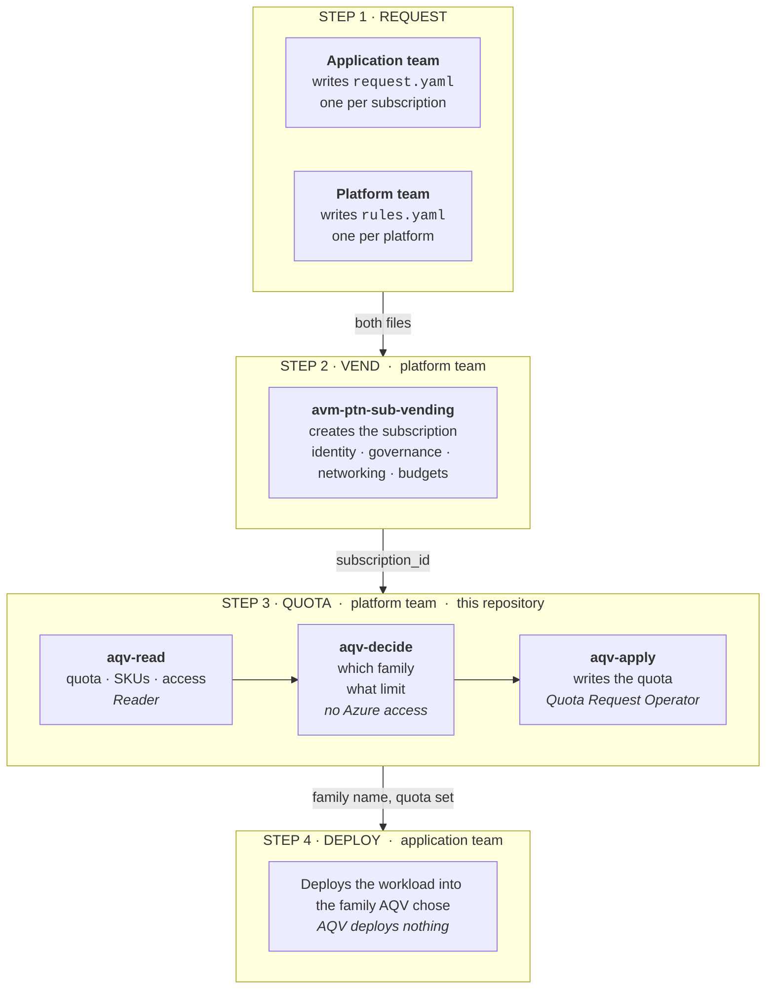
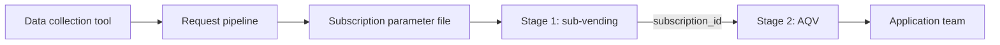
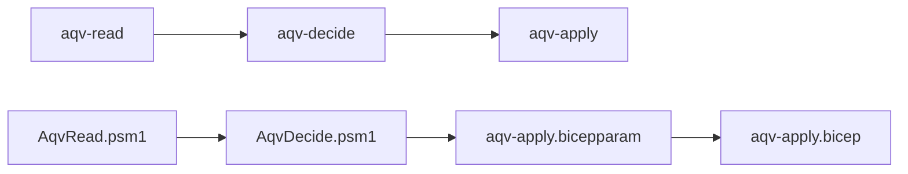
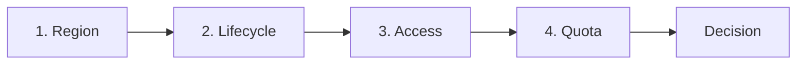

# Azure Quota Vending: the manual

How to run it, what its answers mean, and where it fits in a subscription
vending pipeline.

- [Who does what](#who-does-what)
- [A complete example](#a-complete-example)
- [Where AQV fits](#where-aqv-fits)
- [Prerequisites](#prerequisites)
- [The subscription request](#the-subscription-request)
- [Quickstart: Terraform](#quickstart-terraform)
- [Quickstart: Bicep](#quickstart-bicep)
- [Business rules — reference](#business-rules-reference)
- [Reading a decision](#reading-a-decision)
- [GitHub Actions](#github-actions)
- [Azure behaviour to know](#azure-behaviour-to-know)
- [Not covered yet](#not-covered-yet)

---

## Who does what

Three steps, two teams. Each owns different files and needs different rights.

| | Application team | Platform team |
|---|---|---|
| **Writes** | `request.yaml`, one per subscription | `rules.yaml`, one per platform |
| **Runs** | Nothing required. Optionally the read-only query. | Stage 2, from a pipeline. |
| **Needs** | `Reader`, and only for the optional query. | `Reader` and `Quota Request Operator`. |
| **Receives** | A subscription with quota, and the family to deploy into. | The decision, and why each family lost. |
| **Then does** | Deploys the workload. AQV does not. | Hands the subscription over. |



The two files never mix. A request says what the workload needs. The rules say
what the platform permits. Neither team edits the other's file.

---

## A complete example

Everything in one place: two files, one command, the answer.
Both files are in [`examples/vending-stage-2`](../examples/vending-stage-2).

### 1. The application team writes the request

`request.yaml`, one per subscription. Only the `compute:` block matters to AQV;
the rest is the vending parameter file it lives inside.

```yaml
subscription:
  environment: prod            # selects which rule applies

compute:
  region: eastus
  vcpus: 64
  category: MemoryOptimized
  architecture: x64
  placement:
    type: zone_redundant
    zone_count: 3
```

### 2. The platform team writes the rules

`rules.yaml`, one per platform. The application team never sees this.

```yaml
rules:
  - name: devtest stays off GPU and stays small
    environments: [devtest]
    family_denylist: [standardNCSv3Family, standardNVSv4Family]
    max_vcpus: 32

  - name: production uses approved families, cheapest first
    environments: [prod]
    family_allowlist: [standardDsv6Family, standardDdsv6Family, standardEsv6Family]
    prefer: listed_order

  - name: default            # no environments, so it catches the rest
    max_vcpus: 128
```

### 3. The platform team runs stage 2

```bash
cd examples/vending-stage-2
terraform init
terraform apply -var subscription_id=$SUB
```

Writes are off by default. Add `-var apply_writes=true` to let it set the quota.

### 4. The answer

The request said `environment: prod`, so the second rule applied:

```text
status      : infeasible
reason      : no candidate family is present in the quota
rule applied: production uses approved families, cheapest first
```

That subscription holds no quota for any family on the production allowlist. The
rule did its job: it refused rather than silently choosing something the platform
had not approved.

Change the request to `environment: devtest` and the first rule applies instead:

```text
status      : blocked_by_rule
reason      : rule "devtest stays off GPU and stays small" caps requests at 32 vCPUs
rule applied: devtest stays off GPU and stays small
```

The request asked for 64 vCPUs. The devtest rule caps it at 32.

Both are real output from a PayAsYouGo subscription. Neither wrote anything.

### What the application team gets

The chosen family, and a subscription with the quota for it. They deploy the
workload themselves. They can also re-ask at any time with only `Reader`, using
[`examples/what-can-i-deploy`](../examples/what-can-i-deploy).

---

## Where AQV fits

Microsoft's [subscription vending guidance][vending] lists five deployment
tasks: identity, governance, networking, budgets and reporting. Quota is not one
of them. The Cloud Adoption Framework states the problem but does not solve it:

> They should also review the subscription quota limits before creating the
> subscription

> the quota request can fail, so you should run a script to handle any errors

AQV is that script. It runs as a second stage, after the subscription exists.

**AQV deploys nothing.** It creates no virtual machine, no scale set and no
disk. It sets the subscription's vCPU quota and reports which VM family the
application team should deploy into. The application team deploys the workload
itself, after the handover.



Stage 1 creates and configures the subscription. Stage 2 gives it quota.

| Stage | Module | Task |
|---|---|---|
| 1 | `avm-ptn-sub-vending` | Create the subscription. Apply identity, governance, networking and budgets. |
| 2 | `aqv-read` | Read the quota, the SKUs and the region access. |
| 2 | `aqv-decide` | Choose a VM family. Calculate the quota to set. |
| 2 | `aqv-apply` | Write the quota. |

Both stages read the same parameter file. Stage 1 gives stage 2 one value: the
subscription ID.

### Why two stages and not one module

A new subscription does not exist when Terraform makes a plan. One module would
have to defer every read until apply. The placement decision would then never
appear in a plan.

Stage 2 runs against a subscription that already exists. The plan shows the
chosen family, the quota to write, and the reason each other family was
rejected. You can review all of it before anything is written.

Two stages give three more benefits:

- A separate state file for each landing zone subscription, as the guidance
  recommends.
- No race with provider registration. Registration completes during stage 1.
- No change to the vending module. It already outputs the subscription ID.

---

## Prerequisites

### Tooling

| Path | Needs |
|---|---|
| Terraform | Terraform >= 1.9. CI tests 1.9.8 and the current release. `Azure/azapi` provider >= 2.0. |
| Bicep | PowerShell 7+, `Az.Accounts`, `powershell-yaml`, Bicep CLI |

### Permissions

On the **vended subscription**, the identity running stage 2 needs:

| Role | Why |
|---|---|
| **Reader** | `Microsoft.Compute/skus`, `locations/usages`, and the provider registration |
| **Quota Request Operator** | `Microsoft.Quota/quotas/write` — and `Microsoft.Support/*`, for raising a ticket when a request is refused |

`Quota Request Operator` is a built-in role and is exactly scoped to this job.
Contributor also works but grants far more than AQV needs.

### Authentication

Both paths use whatever the environment is already signed in as — `az login`
locally, or OIDC federated credentials in CI. Nothing stores credentials.

---

## The subscription request

One YAML file for each request. Both stages read it. AQV reads only the
`compute:` block.

### Minimum

```yaml
compute:
  region: eastus
  vcpus: 64
```

### Every option

All fields are optional except `region` and `vcpus`. Omit a field and AQV does
not filter on it.

| Field | Type | Default | Values |
|---|---|---|---|
| `region` | string | **required** | Any Azure region name, for example `eastus`. |
| `vcpus` | number | **required** | Greater than 0. |
| `category` | string | any | `GeneralPurpose`, `ComputeOptimized`, `MemoryOptimized`, `StorageOptimized`, `GpuAccelerated`, `FpgaAccelerated`, `HighPerformanceCompute` |
| `architecture` | string | any | `x64`, `Arm64` |
| `burstable` | string | any | `Excluded`, `Required` |
| `confidential_computing` | string | any | `Excluded`, `Required` |
| `family_allowlist` | list | all | Azure family names, for example `standardEdsv6Family`. |
| `family` | string | none | One Azure family name. |
| `placement.type` | string | `regional` | `regional`, `zonal`, `zone_redundant` |
| `placement.zones` | list | none | Zone numbers. Required when `type` is `zonal`. |
| `placement.zone_count` | number | `3` | Used when `type` is `zone_redundant`. |

Three fields narrow the candidate families. The most specific one wins:

1. `family` selects one family. It overrides everything below.
2. `family_allowlist` limits the candidates to a list.
3. `category` and the attribute fields filter by shape.

`placement.type` is not a preference. It decides which families are eligible.
Azure grants zone access for each SKU size and each zone separately.

The application team states a category. It does not state a VM family. A person
who fills in a subscription request is not expected to know Azure family names.

### Fields AQV reads from outside `compute:`

| Field | Used for |
|---|---|
| `subscription.environment` | Selects which business rule applies. |

### Full example

```yaml
compute:
  region: eastus
  vcpus: 64
  category: MemoryOptimized
  architecture: x64
  burstable: Excluded
  placement:
    type: zone_redundant
    zone_count: 3
```

[`examples/vending-stage-2/request.example.yaml`](../examples/vending-stage-2/request.example.yaml)
shows the `compute:` block inside a complete parameter file.

---

## Quickstart: Terraform

```bash
cd examples/vending-stage-2
terraform init

terraform apply \
  -var subscription_id="$(terraform -chdir=../stage-1 output -raw subscription_id)"
```

Writes are **off by default** so the decision can be reviewed. To let it write:

```bash
terraform apply -var subscription_id="$SUB" -var apply_writes=true
```

### Using the modules directly

```hcl
module "read" {
  source          = "../../modules/aqv-read"
  subscription_id = var.subscription_id
  region          = local.compute.region
}

module "placement" {
  source     = "../../modules/aqv-decide"
  request    = local.request
  quota       = module.read.quota
  sku_access = module.read.sku_access
  rules      = var.placement_rules
}

module "apply" {
  source          = "../../modules/aqv-apply"
  subscription_id = var.subscription_id
  region          = local.compute.region
  writes_required = module.placement.writes_required
  enabled         = var.apply_writes
}
```

> **Consuming `aqv-read` from outside this repo:** it reads the curated lists
> from `knowledge/` by a path relative to itself. A non-local module source
> makes Terraform copy the module into `.terraform/modules`, which breaks that
> path. Set `knowledge_dir` explicitly when that happens.

---

## Quickstart: Bicep

```bash
pwsh -File examples/vending-stage-2-bicep/Invoke-AqvVending.ps1 \
  -SubscriptionId $SUB
```

Evaluates the decision and writes `aqv-apply.bicepparam`. Nothing is deployed.
Add `-Deploy` to apply it.

Bicep cannot read quota state. On this path PowerShell does the read and the
decision. Bicep does the write.



The top row is Terraform. The bottom row is the Bicep path. PowerShell does the
read and the decision. Bicep does only the write.

Both rows must give the same answer. The scenarios in `conformance/scenarios`
test each one.

The script forms no opinion of its own. It serialises `writes_required`
unchanged, so Bicep receives exactly what the Terraform module would have
applied.

### Using the PowerShell modules directly

```powershell
Import-Module ./powershell/AqvRead.psm1
Import-Module ./powershell/AqvDecide.psm1

$state = Get-AqvState -SubscriptionId $sub -Region eastus
$decision = Get-AqvDecision -Request $request -Quota $state.quota `
    -SkuAccess $state.sku_access -Rules $rules
```

---

## Business rules — reference

Rules live in `rules.yaml`, owned by the platform team. See
[A complete example](#a-complete-example) for the file in context.

Rules are evaluated in order. The first rule whose `environments` matches is the
one that applies. A rule with no `environments` matches every request, so place
it last.

| Field | Type | Effect |
|---|---|---|
| `name` | string | Reported as `rule_applied` in the decision. |
| `environments` | list | Which `subscription.environment` values this rule applies to. Omit to match all. |
| `family_allowlist` | list | Only these families may be chosen. |
| `family_denylist` | list | These families are removed. |
| `max_vcpus` | number | A larger request is refused with `blocked_by_rule`. |
| `prefer` | string | `most_unused` (default), `least_unused`, or `listed_order`. |

`listed_order` walks the rule's own `family_allowlist` in order, so the first
entry is tried first. That is how a platform team says "use up the cheap family
before the expensive one". `most_unused` instead picks whichever family has the
most room.

Rules constrain; they do not grant. A rule cannot make a family available that
the subscription has no access to, and it cannot raise a quota that Azure
refuses.

## Reading a decision

AQV applies four gates, in this order.



| Gate | Question | Failure status |
|---|---|---|
| 1. Region | Can the subscription reach the region? | `not_ready`, `blocked_by_region` |
| 2. Lifecycle | Is any candidate family still open to new subscriptions? | `blocked_by_lifecycle` |
| 3. Access | Can the subscription deploy any candidate here? | `blocked_by_access` |
| 4. Quota | Can any candidate reach the requested size? | `needs_increase`, `infeasible` |

A gate means nothing until the gates above it pass. Quota and access are
separate. A quota group grants no regional access and no zonal access. Quota for
a family the subscription cannot deploy is therefore useless. AQV checks access
first.

A business rule can reject the request before any gate runs. That gives
`blocked_by_rule`.

Use `status` to decide what to do next.

| `status` | Meaning | What to do |
|---|---|---|
| `satisfied` | Existing quota covers it. | Nothing. `writes_required` is empty. |
| `needs_allocation` | A quota group can cover the shortfall. | Apply. Allocation is self-service and will succeed. |
| `needs_increase` | A quota limit increase is required. | Apply, but **this is not a promise** — increases are evaluated, not granted. |
| `not_ready` | `Microsoft.Compute` is not registered yet. | **Wait and retry.** Transient, and normal right after vending. |
| `blocked_by_region` | The subscription cannot reach the region at all. | Region access request. No quota action helps. |
| `blocked_by_lifecycle` | Every candidate is under the July 2026 capacity growth restrictions. | Use a successor family — the reason names them. |
| `blocked_by_access` | No candidate can deploy here. | Read `access.remediation`; it names the right ticket, or says there isn't one. |
| `blocked_by_rule` | A business rule refused it. | Change the request or the rule. |
| `infeasible` | No candidate family can reach the requested size. | Different region, family, or size. |

Other fields worth reading:

- **`considered`** — every candidate with its numbers and why it lost. *"Why not
  that family"* is most of what anyone actually asks.
- **`access.remediation`** — names the specific ticket: region/SKU access, zonal
  enablement, or none at all when the offer excludes the SKU or the region has
  no zones.
- **`lifecycle.frozen`** — families usable only within quota already held.
- **`regional.increase_required`** — the region-wide vCPU cap binds, separately
  from the family limit.

### When a write is refused

A refused quota write **fails the apply on purpose**. Terraform cannot catch a
resource error, and it is the right outcome anyway: a vended subscription that
cannot run its workload is a failure, not a caveat.

Three refusal codes, **none retryable**:

| Code | Meaning |
|---|---|
| `ContactSupport` | Self-service is exhausted. A ticket is the only route. |
| `QuotaNotAvailableForResource` | Capacity is not there for this subscription. A smaller ask fares no better. |
| `DeprecatedQuotaType` | The family is growth-restricted. `aqv-decide` predicts this one, so it should never reach the apply. |

---

## GitHub Actions

Three workflows ship in [`.github/workflows`](../.github/workflows):

| Workflow | Trigger | What it does |
|---|---|---|
| `conformance.yml` | push, PR | Runs both implementations against the shared scenarios, plus `terraform test`. **No Azure needed.** |
| `vend-stage-2-terraform.yml` | `workflow_dispatch` | Stage 2, Terraform path. Plans by default; writes only when asked. |
| `vend-stage-2-bicep.yml` | `workflow_dispatch` | Stage 2, Bicep path. |

### Wiring stage 2 to stage 1

Stage 2 needs one value from stage 1. In a single pipeline:

```yaml
  stage-1-vending:
    runs-on: ubuntu-latest
    outputs:
      subscription_id: ${{ steps.vend.outputs.subscription_id }}
    steps:
      - id: vend
        run: |
          terraform -chdir=stage-1 apply -auto-approve
          echo "subscription_id=$(terraform -chdir=stage-1 output -raw subscription_id)" >> "$GITHUB_OUTPUT"

  stage-2-quota:
    needs: stage-1-vending
    uses: ./.github/workflows/vend-stage-2-terraform.yml
    with:
      subscription_id: ${{ needs.stage-1-vending.outputs.subscription_id }}
      request_file: requests/contoso-payments-api.yaml
      apply_writes: true
```

### Authentication

The workflows use OIDC — no stored secrets:

```yaml
permissions:
  id-token: write
  contents: read
```

with `AZURE_CLIENT_ID`, `AZURE_TENANT_ID` and `AZURE_SUBSCRIPTION_ID` as
repository variables. The federated credential needs Reader and Quota Request
Operator on the vended subscription.

### Choosing runners

Two repository variables set `runs-on`. Leave them unset and the workflows use
GitHub-hosted runners. Set them and the jobs run on your own machines.

| Variable | Unset | Set |
|---|---|---|
| `CI_RUNNER_LINUX` | `ubuntu-latest` | that label — Terraform and Bicep jobs |
| `CI_RUNNER_WINDOWS` | `ubuntu-latest` | that label — PowerShell jobs |

The PowerShell jobs need `pwsh`. The Bicep job needs the Azure CLI. Point
`CI_RUNNER_WINDOWS` at a machine with PowerShell. Point `CI_RUNNER_LINUX` at a
machine with `az`.

> **Self-hosted runners cannot be shared between repositories on a personal
> account.** Runner *groups*, the mechanism for sharing, exist only for
> organizations. A machine already running a runner for another repo can host a
> second, independent registration for this one — same machine, separate
> directory and service.

```bash
# Mint a registration token (expires in one hour)
gh api -X POST repos/OWNER/REPO/actions/runners/registration-token -q .token
```

```bash
# On the runner machine, in a NEW directory beside the existing runner
./config.sh --url https://github.com/OWNER/REPO --token <TOKEN>   --name aqv-ci-linux --labels aqv-ci-linux --unattended
sudo ./svc.sh install && sudo ./svc.sh start
```

Then set the variable to the label you chose:

```bash
gh variable set CI_RUNNER_LINUX --body aqv-ci-linux
```

> Do not set the variable before the runner is registered and online, or jobs
> queue waiting for a runner that does not exist.

A public repository gets unlimited GitHub-hosted minutes for standard runners.
If this repository becomes public, none of the above is needed.

### Reviewing before writing

Stage 2 plans against a subscription that already exists. The plan shows the
chosen family, the quota to write, and the reason each other family was
rejected. Review it in the pull request before anything is written.

---

## Azure behaviour to know

[`knowledge/`](../knowledge) records each of these with a date and a source.

| Behaviour | Consequence |
|---|---|
| A family can report a quota limit in a region where Azure offers no sizes of it. | Quota alone does not prove a family is usable. AQV also reads the SKU list. |
| `restrictions[]` can remove zones that `locationInfo[].zones` publishes. The restricted list is not a subset of the published list. | Read both. The published list alone overstates what you can deploy. |
| A `Zone` restriction blocks zonal deployment only. Regional deployment still works. | A zone refusal is not a region refusal. |
| Some regions have no availability zones. | No support ticket adds zones to a region. |
| `Microsoft.Compute/skus` returns a full catalogue for a region the subscription cannot use. | Only the quota read detects a missing region grant. |
| New subscriptions cannot deploy the 30 growth-restricted series at all. | This is not a limit on growth. It is a block on deployment. |
| A `202` from a quota PUT means Azure accepted the request for review. | It is not an approval. Poll for the result. |
| `isQuotaApplicable` can return `true` for a family whose write is then refused. | Do not use it as a pre-check. |

## Not covered yet

**Quota groups.** `Microsoft.Quota/groupQuotas` would let a platform pool quota
across subscriptions and reallocate it self-service — including harvesting
The contract is in place: set `quota.families[*].available` and the decision
returns `needs_allocation` instead of `needs_increase`. Testing it needs an EA,
MCA-Enterprise or Internal billing account.
[`knowledge/quota-groups.yaml`](../knowledge/quota-groups.yaml).

**The ODCR capacity buffer.** Deferred deliberately. A capacity reservation
binds to an exact VM size, which suits a customer who has already fixed on one
and not the flexible-request case that is most of the value. It also needs quota
in the *consuming* subscription, which growth restrictions can make
unobtainable. See [`knowledge/capacity-signals.yaml`](../knowledge/capacity-signals.yaml).

[vending]: https://learn.microsoft.com/en-us/azure/architecture/landing-zones/subscription-vending
