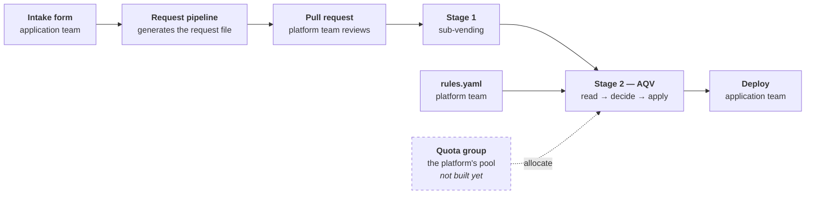
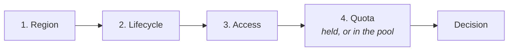

# Azure Quota Vending: the manual

How to run it, what its answers mean, and where it fits in a subscription
vending pipeline.

- [Who does what](#who-does-what)
- [Step by step](#step-by-step)
- [After the handover — the workload team](#after-the-handover--the-workload-team)
- [Where AQV fits](#where-aqv-fits)
- [Prerequisites](#prerequisites)
- [The subscription request](#the-subscription-request)
- [Using the modules directly](#using-the-modules-directly)
- [Business rules reference](#business-rules-reference)
- [Reading a decision](#reading-a-decision)
- [GitHub Actions](#github-actions)
- [Why Bicep works differently](#why-bicep-works-differently)
- [Azure behaviour to know](#azure-behaviour-to-know)
- [Not covered yet](#not-covered-yet)

---

## Who does what

The application team fills in a form. They do not write YAML, and they do not
have access to the platform repository.

Everything else belongs to the platform team: the form, the automation behind
it, both YAML files, and the pipelines.



The application team touches the first box and the last one. Everything between
belongs to the platform team.

The dashed box is the quota group, the pool stage 2 is meant to allocate from.
It is **not built yet**, so today stage 2 reports what the subscription can
already run and writes only the regional cap.

### The boundary

| | Application team | Platform team |
|---|---|---|
| **Touches** | The intake form only. | The form, the pipelines, both YAML files. |
| **Writes YAML** | No. The request pipeline generates it. | Yes, `rules.yaml`, by hand. |
| **Repository access** | None required. | Owns it. |
| **Azure rights** | None required. Optionally `Reader` on their own subscription. | `Reader` and `Quota Request Operator`. |
| **Receives** | A subscription with quota, the family, and the sizes inside it that fit. | The decision, and why each family lost. |

### What the form asks, and what it becomes

The platform team designs the form. These are the questions that produce the
`compute:` block. Phrase them for someone who does not know Azure VM families.

| Ask the application team | Becomes | Example |
|---|---|---|
| Which Azure region? | `compute.region` | `eastus` |
| How many vCPUs in total? | `compute.vcpus` | `64` |
| What kind of workload? *(pick one)* | `compute.category` | Memory-heavy → `MemoryOptimized` |
| Must it survive a datacentre failure? | `compute.placement` | Yes → `zone_redundant` |
| Does it need Arm? | `compute.architecture` | No → `x64` |
| Production or DevTest? | `subscription.environment` | `prod` — selects which rule applies |

Nobody is asked to name a VM family. That is what AQV works out.

### Where the files sit

```
platform-repo/
├── platform/
│   └── rules.yaml                    hand-written, one per platform
├── requests/
│   ├── payments-api.yaml             generated by the request pipeline
│   └── reporting-service.yaml        one file per subscription
└── .github/workflows/
    ├── vend-stage-2-terraform.yml
    └── conformance.yml
```

Both files are read by the deployment pipeline. Neither is read by Azure.

---

## Step by step

Steps 1 to 9 are the platform team. Steps 10 to 12 are the workload team.
Steps 1 to 5 write nothing to Azure.

Where a step differs between the Terraform path and the Bicep path, or between
the command line and the portal, each one is behind a heading you can open.
GitHub does not render tabs, so these are collapsible sections instead. The
first is open already.

### 1. Get the modules

Copy this repository into your platform repository, or reference it directly.

```bash
git clone https://github.com/chrislittle/azure-quota-vending.git
cd azure-quota-vending
```

### 2. Write your rules

One file for the whole platform. Start minimal and add rules later.

`platform/rules.yaml`:

```yaml
rules:
  - name: devtest stays small
    environments: [devtest]
    max_vcpus: 32

  - name: default
    max_vcpus: 128
```

[`examples/vending-stage-2/rules.example.yaml`](../examples/vending-stage-2/rules.example.yaml)
shows the richer version, with allowlists and ordering.

Rules are evaluated in order. The first match wins. Put a rule with no
`environments` last, so it catches everything else.

### 3. Create a request

In production the request pipeline generates this from the intake form. To try
it by hand:

`requests/my-app.yaml`:

```yaml
subscription:
  environment: prod

compute:
  region: eastus
  vcpus: 8
  category: GeneralPurpose
```

Ask for a size the subscription can actually reach. A new subscription often has
a regional cap of 10 vCPUs, so start small and confirm the mechanics before
asking for more.

### 4. Ask what the subscription can do — no write access needed

Before wiring anything up, check the answer by hand. This needs only `Reader`.

<details open>
<summary><b>Terraform</b></summary>

```bash
cd examples/what-can-i-deploy
terraform init
terraform apply -var subscription_id=$SUB -var region=eastus -var vcpus=8
```
</details>

<details>
<summary><b>PowerShell</b></summary>

```powershell
cd examples/what-can-i-deploy
./Get-WhatCanIDeploy.ps1 -SubscriptionId $sub -Region eastus -VCpus 8
```
</details>

There is no Bicep here. Bicep only writes, and this asks a question.

Both give the same answer. The PowerShell one formats it for a person:

```text
  Can I deploy 8 vCPUs in eastus?
  Yes

  status     : satisfied
  reason     : existing quota covers the request
  rule       : none — this is the quota the subscription has
  use family : StandardDadsv7Family

  Sizes you can deploy:
    Standard_D8ads_v7            8 vCPU   deploy 1
    Standard_D4ads_v7            4 vCPU   deploy 2
    Standard_D2ads_v7            2 vCPU   deploy 4

  Why not the others:
    StandardDadsv7Family               limit=10     unused=10     chosen
    standardAv2Family                  limit=10     unused=10     eligible, outranked
    StandardFadsv7Family               limit=10     unused=10     eligible, outranked
```

Terraform returns the same decision as named outputs — `answer`, `sizes`,
`why_not_the_others`, `blocked` and `what_would_need_writing`. Nothing is
written on either path.

### 5. Run stage 2 without writing

<details open>
<summary><b>Terraform</b></summary>

```bash
cd examples/vending-stage-2
terraform init
terraform apply \
  -var subscription_id=$SUB \
  -var request_file=../../requests/my-app.yaml \
  -var rules_file=../../platform/rules.yaml
```
`apply_writes` defaults to false, so this writes nothing.

</details>

<details>
<summary><b>Bicep</b></summary>

```powershell
cd examples/vending-stage-2-bicep
./Invoke-AqvVending.ps1 -SubscriptionId $sub `
    -RequestFile ../../requests/my-app.yaml `
    -RulesFile ../../platform/rules.yaml
```
PowerShell reads and decides; Bicep only writes. Without `-Deploy` this writes a
`.bicepparam` and stops. See
[Why Bicep works differently](#why-bicep-works-differently).

</details>

Both apply the same rules and reach the same decision. Terraform prints it
through the `summary` output:

```text
status      : satisfied
reason      : existing quota covers the request
rule applied: default
family      : StandardDadsv7Family
writes      : 0
```

`satisfied` with no writes means the quota is already there. A request the rules
refuse looks like this instead — the same command against a `devtest` request
for 64 vCPUs:

```text
status      : blocked_by_rule
reason      : rule "devtest stays small" caps requests at 32 vCPUs
rule applied: devtest stays small
family      : none
writes      : 0
```

`satisfied` with no writes means the quota is already there. Stop here if that is
all you needed. Steps 6 to 9 matter when something has to be written — today
that means the regional cap, and once quota groups are wired up it also means
allocating from the pool.

### 6. Grant the pipeline identity its rights

Only now does anything need write access. Two roles on the target subscription:
`Reader` and `Quota Request Operator`.

<details open>
<summary><b>Azure CLI</b></summary>

```bash
APP_ID=$(az ad app create --display-name aqv-pipeline --query appId -o tsv)
az ad sp create --id "$APP_ID"

az role assignment create --assignee "$APP_ID" \
  --role "Reader" --scope "/subscriptions/$SUB"

az role assignment create --assignee "$APP_ID" \
  --role "Quota Request Operator" --scope "/subscriptions/$SUB"
```
</details>

<details>
<summary><b>Azure PowerShell</b></summary>

```powershell
$app = New-AzADApplication -DisplayName aqv-pipeline
New-AzADServicePrincipal -ApplicationId $app.AppId

New-AzRoleAssignment -ApplicationId $app.AppId `
    -RoleDefinitionName 'Reader' -Scope "/subscriptions/$sub"

New-AzRoleAssignment -ApplicationId $app.AppId `
    -RoleDefinitionName 'Quota Request Operator' -Scope "/subscriptions/$sub"
```

</details>

<details>
<summary><b>Portal</b></summary>

1. **Microsoft Entra ID** > **App registrations** > **New registration**. Name
   it `aqv-pipeline` and register it. Copy the **Application (client) ID**.
2. Open the subscription > **Access control (IAM)** > **Add** > **Add role
   assignment**.
3. Pick **Reader**, then **Members** > **Select members**, and choose
   `aqv-pipeline`. Review and assign.
4. Repeat from step 2 for **Quota Request Operator**.

</details>

`Quota Request Operator` is the built-in role that carries
`Microsoft.Quota/quotas/write`, and `Microsoft.Support/*` with it. Contributor
also works and grants far more.

### 7. Let GitHub Actions use that identity

A federated credential, so no secret is stored:

<details open>
<summary><b>Azure CLI</b></summary>

```bash
az ad app federated-credential create --id "$APP_ID" --parameters '{
  "name": "aqv-main",
  "issuer": "https://token.actions.githubusercontent.com",
  "subject": "repo:YOUR-ORG/YOUR-REPO:ref:refs/heads/main",
  "audiences": ["api://AzureADTokenExchange"]
}'
```
</details>

<details>
<summary><b>Azure PowerShell</b></summary>

```powershell
$app = Get-AzADApplication -DisplayName aqv-pipeline

New-AzADAppFederatedCredential -ApplicationObjectId $app.Id `
    -Name aqv-main `
    -Issuer 'https://token.actions.githubusercontent.com' `
    -Subject 'repo:YOUR-ORG/YOUR-REPO:ref:refs/heads/main' `
    -Audience 'api://AzureADTokenExchange'
```

</details>

<details>
<summary><b>Portal</b></summary>

1. **Microsoft Entra ID** > **App registrations** > `aqv-pipeline`.
2. **Certificates & secrets** > **Federated credentials** > **Add credential**.
3. Scenario: **GitHub Actions deploying Azure resources**.
4. Enter your organization and repository, entity type **Branch**, branch
   `main`, and name it `aqv-main`.

</details>

The subject must match what the workflow presents. A workflow that runs on a tag
or in an environment needs a different subject, and a mismatch fails the login
without saying why.

Then set the two repository variables the workflows read:

```bash
gh variable set AZURE_CLIENT_ID --body "$APP_ID"
gh variable set AZURE_TENANT_ID --body "$(az account show --query tenantId -o tsv)"
```

### 8. Add the workflow

```bash
cp .github/workflows/vend-stage-2-terraform.yml YOUR-REPO/.github/workflows/
```

Run it from the Actions tab, or call it from your stage 1 workflow:

```yaml
  stage-2-quota:
    needs: stage-1-vending
    uses: ./.github/workflows/vend-stage-2-terraform.yml
    with:
      subscription_id: ${{ needs.stage-1-vending.outputs.subscription_id }}
      request_file: requests/my-app.yaml
      apply_writes: true
```

### 9. Let it write

<details open>
<summary><b>Terraform</b></summary>

```bash
terraform apply -var subscription_id=$SUB -var apply_writes=true
```
</details>

<details>
<summary><b>Bicep</b></summary>

```powershell
./Invoke-AqvVending.ps1 -SubscriptionId $sub -Deploy
```
</details>

A quota write is slow. Raising one family limit from 10 to 16 took three and a
half minutes. This one was driven through `aqv-apply` directly, because without
a quota group the decision never asks for a family limit — see
[What AQV will and will not ask Azure for](#what-aqv-will-and-will-not-ask-azure-for):

```text
module.apply.azapi_update_resource.family[0]: Creating...
module.apply.azapi_update_resource.family[0]: Still creating... [00m10s elapsed]
...
module.apply.azapi_update_resource.family[0]: Creation complete after 3m37s

Apply complete! Resources: 1 added, 0 changed, 0 destroyed.

Outputs:

applied = [
  {
    "granted" = 16
    "name" = "StandardDsv6Family"
    "requested" = 16
    "scope" = "family"
  },
]
```

`granted` is read back from Azure rather than assumed, so it can be lower than
`requested`.

A refused quota write fails the run on purpose. See
[Reading a decision](#reading-a-decision) for what each refusal means, and
[Azure behaviour to know](#azure-behaviour-to-know) for the case where the write
succeeds and Terraform reports a failure anyway.

---

## After the handover — the workload team

Everything above is the platform team. This is where the workload team picks it
up.

### 10. They are told what they got

The platform team's pipeline produces the decision as an artifact. The vending
guidance already has a step for this: *"Update the data collection tool request
with the final subscription name and GUID… Notify the application team that the
subscription is ready."* The decision belongs in that notification.

What they receive is `decision.json`. This is a real run: a `prod` request for
8 vCPUs of `GeneralPurpose` in `eastus`, against a subscription whose regional
cap is 16 vCPUs and whose limit on the chosen family is 10. Only `considered` is
left out, because it lists every one of the 15 families that were weighed.

```json
{
  "access": {
    "checked": true,
    "denied": [],
    "not_offered": [],
    "placement": "regional",
    "provider_registered": true,
    "region_accessible": true,
    "region_zonal": true,
    "remediation": null,
    "requestable": false,
    "unverified": [],
    "verified": true,
    "zone_count": 0,
    "zones": []
  },
  "category": "GeneralPurpose",
  "family": "StandardDadsv7Family",
  "lifecycle": {
    "denied": [
      "standardBSFamily",
      "standardDASv4Family",
      "standardDDSv4Family",
      "standardDDv4Family",
      "standardDSv3Family",
      "standardDSv4Family",
      "standardDv3Family",
      "standardDv4Family"
    ],
    "frozen": [],
    "new_subscription": true,
    "successors": []
  },
  "preference": "most_unused",
  "reason": "existing quota covers the request",
  "region": "eastus",
  "regional": {
    "increase_required": false,
    "limit": 16,
    "target": 16,
    "unused": 16,
    "used": 0
  },
  "rule_applied": "default",
  "sizes": [
    {
      "count_at": 1,
      "name": "Standard_D8ads_v7",
      "vcpus": 8,
      "zones": [
        "1",
        "2",
        "3"
      ]
    },
    {
      "count_at": 2,
      "name": "Standard_D4ads_v7",
      "vcpus": 4,
      "zones": [
        "1",
        "2",
        "3"
      ]
    },
    {
      "count_at": 4,
      "name": "Standard_D2ads_v7",
      "vcpus": 2,
      "zones": [
        "1",
        "2",
        "3"
      ]
    }
  ],
  "status": "satisfied",
  "target_limit": 10,
  "unknown_families": [],
  "vcpus": 8
}
```

| Field | Meaning |
|---|---|
| `status` | `satisfied` means the quota was already there and nothing was written. |
| `family` | The VM family the quota is for. A family cannot be deployed; a size can. |
| `sizes` | What to actually deploy, largest first. `count_at` is how many of that size the request needs. |
| `sizes[].zones` | The zones that size can go in, after Azure's restrictions are subtracted. This is per size, not per vCPU. |
| `regional.limit` | The region-wide vCPU cap, shared by every family in the subscription. |
| `lifecycle.denied` | Families a new subscription cannot deploy at all, under the July 2026 capacity growth restrictions. |
| `access.remediation` | `null` here because nothing was refused. It names the ticket to raise when something was. |

`sizes` stops at 8 vCPUs even though the family has larger ones. A single
`Standard_D16ads_v7` would need 16 vCPUs of quota and the limit is 10, so
naming it would be wrong.

If the request was refused they get the reason instead, and no quota was
written:

```text
status      : blocked_by_rule
reason      : rule "devtest stays small" caps requests at 32 vCPUs
rule applied: devtest stays small
family      : none
writes      : 0
```

### 11. They can check for themselves, at any time

They do not have to rely on a message from weeks ago. With only `Reader` on
their own subscription:

<details open>
<summary><b>PowerShell</b></summary>

```powershell
./Get-WhatCanIDeploy.ps1 -SubscriptionId $sub -Region eastus -VCpus 8
```
```text
  Can I deploy 8 vCPUs in eastus?
  Yes

  status     : satisfied
  reason     : existing quota covers the request
  rule       : none — this is the quota the subscription has
  use family : StandardDadsv7Family

  Sizes you can deploy:
    Standard_D8ads_v7            8 vCPU   deploy 1
    Standard_D4ads_v7            4 vCPU   deploy 2
    Standard_D2ads_v7            2 vCPU   deploy 4

  Why not the others:
    StandardDadsv7Family               limit=10     unused=10     chosen
    standardAv2Family                  limit=10     unused=10     eligible, outranked
    StandardFadsv7Family               limit=10     unused=10     eligible, outranked
```

</details>

<details>
<summary><b>Terraform</b></summary>

```bash
terraform apply -var subscription_id=$SUB -var region=eastus -var vcpus=8
```
The same decision, as outputs. `answer` carries the status and the family;
`sizes` carries the same list:

```text
sizes = [
  {
    "count_at" = 1
    "name" = "Standard_D8ads_v7"
    "vcpus" = 8
    "zones" = tolist([
      "1",
      "2",
      "3",
    ])
  },
  {
    "count_at" = 2
    "name" = "Standard_D4ads_v7"
    "vcpus" = 4
    ...
  },
]
```

</details>


This reads the quota the subscription actually has. It does not apply the
platform's rules, and it does not need to: the rules already decided what quota
was granted. Asking again does not re-run them.

Rules are enforced in the pipeline, where the platform team controls which rules
file is used. A script the workload team runs could never enforce anything —
they would simply not pass the file.

`-RulesFile` exists for a platform engineer who wants to preview a decision
before running the pipeline. The workload team does not need it.

### 12. They deploy

A family cannot be deployed. A size can. The decision names the sizes in the
chosen family that fit the request:

```text
Standard_D8ads_v7    8 vCPU   deploy 1
Standard_D4ads_v7    4 vCPU   deploy 2
Standard_D2ads_v7    2 vCPU   deploy 4
```

Pick one and use it in the workload team's own IaC. This is their code, in their
pipeline, and nothing in this repository runs it:

```hcl
resource "azurerm_linux_virtual_machine" "app" {
  name                = "app-01"
  resource_group_name = azurerm_resource_group.app.name
  location            = "eastus"

  # From the decision: decision.sizes[].name
  size = "Standard_D8ads_v7"

  # From the request: placement.type was zone_redundant, so spread across
  # decision.sizes[].zones
  zone = "1"
  # ...
}
```

```bicep
resource app 'Microsoft.Compute/virtualMachines@2024-07-01' = {
  name: 'app-01'
  location: 'eastus'
  zones: ['1']
  properties: {
    hardwareProfile: {
      vmSize: 'Standard_D8ads_v7'   // from the decision
    }
    // ...
  }
}
```

If the deployment fails for capacity, the quota was never the problem. Quota is
permission to allocate, not a reservation. Re-run step 11 to see whether
anything about the subscription has changed.

---

## Where AQV fits

Microsoft's [subscription vending guidance][vending] lists five deployment
tasks: identity, governance, networking, budgets and reporting. Quota is not one
of them. The Cloud Adoption Framework states the problem but does not solve it:

> They should also review the subscription quota limits before creating the
> subscription

> the quota request can fail, so you should run a script to handle any errors

AQV is that script. It runs as a second stage, after the subscription exists.

**AQV deploys nothing.** It creates no virtual machine, no scale set and no
disk. It sets the subscription's vCPU quota and reports which VM family the
application team should deploy into. The application team deploys the workload
itself, after the handover.

Stage 1 creates and configures the subscription. Stage 2 gives it quota.

| Stage | Module | Task |
|---|---|---|
| 1 | `avm-ptn-sub-vending` | Create the subscription. Apply identity, governance, networking and budgets. |
| 2 | `aqv-read` | Read the quota, the SKUs and the region access. |
| 2 | `aqv-decide` | Choose a VM family. Calculate the quota to set. |
| 2 | `aqv-apply` | Write the quota. |

Gate 4 asks whether a candidate can reach the requested size from the quota it
already holds, or from a quota group behind it. **The quota group layer is not
built yet**, so today only the first half of that applies.

Both stages read the same parameter file. Stage 1 gives stage 2 one value: the
subscription ID.

### Why two stages and not one module

A new subscription does not exist when Terraform makes a plan. One module would
have to defer every read until apply. The placement decision would then never
appear in a plan.

Stage 2 runs against a subscription that already exists. The plan shows the
chosen family, the quota to write, and the reason each other family was
rejected. You can review all of it before anything is written.

Two stages give three more benefits:

- A separate state file for each landing zone subscription, as the guidance
  recommends.
- No race with provider registration. Registration completes during stage 1.
- No change to the vending module. It already outputs the subscription ID.

---

## Prerequisites

### Tooling

| Path | Needs |
|---|---|
| Terraform | Terraform >= 1.9. CI tests 1.9.8 and the current release. `Azure/azapi` provider >= 2.0. |
| Bicep | PowerShell 7+, `Az.Accounts`, `powershell-yaml`, Bicep CLI |

### Permissions

On the **vended subscription**, the identity running stage 2 needs:

| Role | Why |
|---|---|
| **Reader** | `Microsoft.Compute/skus`, `locations/usages`, and the provider registration |
| **Quota Request Operator** | `Microsoft.Quota/quotas/write` — and `Microsoft.Support/*`, for raising a ticket when a request is refused |

`Quota Request Operator` is a built-in role and is exactly scoped to this job.
Contributor also works but grants far more than AQV needs.

### Authentication

Both paths use whatever the environment is already signed in as — `az login`
locally, or OIDC federated credentials in CI. Nothing stores credentials.

---

## The subscription request

One YAML file for each request. Both stages read it. AQV reads only the
`compute:` block.

### Minimum

```yaml
compute:
  region: eastus
  vcpus: 64
```

### Every option

All fields are optional except `region` and `vcpus`. Omit a field and AQV does
not filter on it.

| Field | Type | Default | Values |
|---|---|---|---|
| `region` | string | **required** | Any Azure region name, for example `eastus`. |
| `vcpus` | number | **required** | Greater than 0. |
| `category` | string | any | `GeneralPurpose`, `ComputeOptimized`, `MemoryOptimized`, `StorageOptimized`, `GpuAccelerated`, `FpgaAccelerated`, `HighPerformanceCompute` |
| `architecture` | string | any | `x64`, `Arm64` |
| `burstable` | string | any | `Excluded`, `Required` |
| `confidential_computing` | string | any | `Excluded`, `Required` |
| `family_allowlist` | list | all | Azure family names, for example `standardEdsv6Family`. |
| `family` | string | none | One Azure family name. |
| `placement.type` | string | `regional` | `regional`, `zonal`, `zone_redundant` |
| `placement.zones` | list | none | Zone numbers. Required when `type` is `zonal`. |
| `placement.zone_count` | number | `3` | Used when `type` is `zone_redundant`. |

Three fields narrow the candidate families. The most specific one wins:

1. `family` selects one family. It overrides everything below.
2. `family_allowlist` limits the candidates to a list.
3. `category` and the attribute fields filter by shape.

`placement.type` is not a preference. It decides which families are eligible.
Azure grants zone access for each SKU size and each zone separately.

The application team states a category. It does not state a VM family. A person
who fills in a subscription request is not expected to know Azure family names.

### Fields AQV reads from outside `compute:`

| Field | Used for |
|---|---|
| `subscription.environment` | Selects which business rule applies. |

### Full example

```yaml
compute:
  region: eastus
  vcpus: 64
  category: MemoryOptimized
  architecture: x64
  burstable: Excluded
  placement:
    type: zone_redundant
    zone_count: 3
```

[`examples/vending-stage-2/request.example.yaml`](../examples/vending-stage-2/request.example.yaml)
shows the `compute:` block inside a complete parameter file.

---

## Using the modules directly

[Step by step](#step-by-step) covers the normal path. This is for wiring the
modules into something of your own.

### Terraform

```hcl
module "read" {
  source          = "./modules/aqv-read"
  subscription_id = var.subscription_id
  region          = local.compute.region
}

module "decide" {
  source     = "./modules/aqv-decide"
  request    = local.request
  quota      = module.read.quota
  sku_access = module.read.sku_access
  rules      = local.rules
}

module "apply" {
  source          = "./modules/aqv-apply"
  subscription_id = var.subscription_id
  region          = local.compute.region
  writes_required = module.decide.writes_required
  enabled         = var.apply_writes
}
```

> `aqv-read` reads `knowledge/` by a path relative to itself. A non-local module
> source makes Terraform copy the module into `.terraform/modules`, which breaks
> that path. Set `knowledge_dir` when that happens.

### PowerShell, for the Bicep path

```powershell
Import-Module ./powershell/AqvRead.psm1
Import-Module ./powershell/AqvDecide.psm1

$state    = Get-AqvState -SubscriptionId $sub -Region eastus
$decision = Get-AqvDecision -Request $request -Quota $state.quota `
                -SkuAccess $state.sku_access -Rules $rules
```

`$decision.writes_required` is the shape
[`bicep/aqv-apply.bicep`](../bicep/aqv-apply.bicep) takes. Serialise it to a
`.bicepparam` and deploy that;
[`examples/vending-stage-2-bicep`](../examples/vending-stage-2-bicep) does
exactly this.

Bicep cannot read quota state, so the read and the decision happen in PowerShell
and Bicep only writes. See
[Why Bicep works differently](#why-bicep-works-differently).

## Business rules reference

Rules live in `rules.yaml`, owned by the platform team. See
[Step by step](#step-by-step) for the file in context.

Rules are evaluated in order. The first rule whose `environments` matches is the
one that applies. A rule with no `environments` matches every request, so place
it last.

| Field | Type | Effect |
|---|---|---|
| `name` | string | Reported as `rule_applied` in the decision. |
| `environments` | list | Which `subscription.environment` values this rule applies to. Omit to match all. |
| `family_allowlist` | list | Only these families may be chosen. |
| `family_denylist` | list | These families are removed. |
| `max_vcpus` | number | A larger request is refused with `blocked_by_rule`. |
| `prefer` | string | `most_unused` (default), `least_unused`, or `listed_order`. |

`listed_order` walks the rule's own `family_allowlist` in order, so the first
entry is tried first. That is how a platform team says "use up the cheap family
before the expensive one". `most_unused` instead picks whichever family has the
most room.

Rules constrain; they do not grant. A rule cannot make a family available that
the subscription has no access to, and it cannot raise a quota that Azure
refuses.

## Reading a decision

AQV applies four gates, in this order.



| Gate | Question | Failure status |
|---|---|---|
| 1. Region | Can the subscription reach the region? | `not_ready`, `blocked_by_region` |
| 2. Lifecycle | Is any candidate family still open to new subscriptions? | `blocked_by_lifecycle` |
| 3. Access | Can the subscription deploy any candidate here? | `blocked_by_access` |
| 4. Quota | Can any candidate reach the requested size? | `needs_increase`, `infeasible` |

A gate means nothing until the gates above it pass. Quota and access are
separate. A quota group grants no regional access and no zonal access. Quota for
a family the subscription cannot deploy is therefore useless. AQV checks access
first.

A business rule can reject the request before any gate runs. That gives
`blocked_by_rule`.

Use `status` to decide what to do next.

| `status` | Meaning | What to do |
|---|---|---|
| `satisfied` | Existing quota covers it. | Nothing. `writes_required` is empty. |
| `needs_allocation` | A quota group covers the shortfall. | Apply. Allocation is self-service and will succeed. **Needs a quota group, which is not built yet.** |
| `needs_increase` | The regional cap has to be raised. | Apply, but **this is not a promise** — increases are evaluated, not granted. |
| `not_ready` | `Microsoft.Compute` is not registered yet. | **Wait and retry.** Transient, and normal right after vending. |
| `blocked_by_region` | The subscription cannot reach the region at all. | Region access request. No quota action helps. |
| `blocked_by_lifecycle` | Every candidate is under the July 2026 capacity growth restrictions. | Use a successor family — the reason names them. |
| `blocked_by_access` | No candidate can deploy here. | Read `access.remediation`; it names the right ticket, or says there isn't one. |
| `blocked_by_rule` | A business rule refused it. | Change the request or the rule. |
| `infeasible` | No candidate family can reach the requested size. | Different region, family, or size. |

### What AQV will and will not ask Azure for

A family is a candidate only when the quota it already has, or a quota group
behind it, covers the request. AQV does not ask Azure to raise a family limit
that is short.

That is deliberate. The design draws quota from a **quota group** the platform
owns, where allocation is self-service and succeeds. A per-subscription increase
is a request Azure evaluates and often refuses, which is not something to build
a vending pipeline on.

**The quota group layer is not built yet.** On a subscription without one,
`available` is null for every family, nothing is allocatable, and an ask above
the current limit returns `infeasible`. The only write AQV produces today is the
regional cap, when a family has the headroom but the cap does not.

`writes_required` will carry a family limit once quota groups are wired up. See
[Not covered yet](#not-covered-yet).

Other fields worth reading:

- **`considered`** — every candidate with its numbers and why it lost. *"Why not
  that family"* is most of what anyone actually asks.
- **`access.remediation`** — names the specific ticket: region/SKU access, zonal
  enablement, or none at all when the offer excludes the SKU or the region has
  no zones.
- **`lifecycle.frozen`** — families usable only within quota already held.
- **`regional.increase_required`** — the region-wide vCPU cap binds, separately
  from the family limit.

### When a write is refused

A refused quota write **fails the apply on purpose**. Terraform cannot catch a
resource error, and it is the right outcome anyway: a vended subscription that
cannot run its workload is a failure, not a caveat.

Three refusal codes, **none retryable**:

| Code | Meaning |
|---|---|
| `ContactSupport` | Self-service is exhausted. A ticket is the only route. |
| `QuotaNotAvailableForResource` | Capacity is not there for this subscription. A smaller ask fares no better. |
| `DeprecatedQuotaType` | The family is growth-restricted. `aqv-decide` predicts this one, so it should never reach the apply. |

`PreconditionFailed` is not one of these. It comes from polling the operation,
not from the decision, and it has been seen on a write that Azure completed. Read
the quota back before treating it as a refusal.

---

## GitHub Actions

Three workflows ship in [`.github/workflows`](../.github/workflows):

| Workflow | Trigger | What it does |
|---|---|---|
| `conformance.yml` | push, PR | Runs both implementations against the shared scenarios, plus `terraform test`. **No Azure needed.** |
| `vend-stage-2-terraform.yml` | `workflow_dispatch` | Stage 2, Terraform path. Plans by default; writes only when asked. |
| `vend-stage-2-bicep.yml` | `workflow_dispatch` | Stage 2, Bicep path. |

### Wiring stage 2 to stage 1

Stage 2 needs one value from stage 1. In a single pipeline:

```yaml
  stage-1-vending:
    runs-on: ubuntu-latest
    outputs:
      subscription_id: ${{ steps.vend.outputs.subscription_id }}
    steps:
      - id: vend
        run: |
          terraform -chdir=stage-1 apply -auto-approve
          echo "subscription_id=$(terraform -chdir=stage-1 output -raw subscription_id)" >> "$GITHUB_OUTPUT"

  stage-2-quota:
    needs: stage-1-vending
    uses: ./.github/workflows/vend-stage-2-terraform.yml
    with:
      subscription_id: ${{ needs.stage-1-vending.outputs.subscription_id }}
      request_file: requests/contoso-payments-api.yaml
      apply_writes: true
```

### Authentication

The workflows use OIDC — no stored secrets:

```yaml
permissions:
  id-token: write
  contents: read
```

with `AZURE_CLIENT_ID`, `AZURE_TENANT_ID` and `AZURE_SUBSCRIPTION_ID` as
repository variables. The federated credential needs Reader and Quota Request
Operator on the vended subscription.

### Choosing runners

Two repository variables set `runs-on`. Leave them unset and the workflows use
GitHub-hosted runners. Set them and the jobs run on your own machines.

| Variable | Unset | Set |
|---|---|---|
| `CI_RUNNER_LINUX` | `ubuntu-latest` | that label — Terraform and Bicep jobs |
| `CI_RUNNER_WINDOWS` | `ubuntu-latest` | that label — PowerShell jobs |

The PowerShell jobs need `pwsh`. The Bicep job needs the Azure CLI. Point
`CI_RUNNER_WINDOWS` at a machine with PowerShell. Point `CI_RUNNER_LINUX` at a
machine with `az`.

> **Self-hosted runners cannot be shared between repositories on a personal
> account.** Runner *groups*, the mechanism for sharing, exist only for
> organizations. A machine already running a runner for another repo can host a
> second, independent registration for this one — same machine, separate
> directory and service.

```bash
# Mint a registration token (expires in one hour)
gh api -X POST repos/OWNER/REPO/actions/runners/registration-token -q .token
```

```bash
# On the runner machine, in a NEW directory beside the existing runner
./config.sh --url https://github.com/OWNER/REPO --token <TOKEN> \
  --name aqv-ci-linux --labels aqv-ci-linux --unattended
sudo ./svc.sh install && sudo ./svc.sh start
```

Then set the variable to the label you chose:

```bash
gh variable set CI_RUNNER_LINUX --body aqv-ci-linux
```

> Do not set the variable before the runner is registered and online, or jobs
> queue waiting for a runner that does not exist.

A public repository gets unlimited GitHub-hosted minutes for standard runners.
If this repository becomes public, none of the above is needed.

### Reviewing before writing

Stage 2 plans against a subscription that already exists. The plan shows the
chosen family, the quota to write, and the reason each other family was
rejected. Review it in the pull request before anything is written.

---

## Azure behaviour to know

[`knowledge/`](../knowledge) records each of these with a date and a source.

| Behaviour | Consequence |
|---|---|
| A family can report a quota limit in a region where Azure offers no sizes of it. | Quota alone does not prove a family is usable. AQV also reads the SKU list. |
| `restrictions[]` can remove zones that `locationInfo[].zones` publishes. The restricted list is not a subset of the published list. | Read both. The published list alone overstates what you can deploy. |
| A `Zone` restriction blocks zonal deployment only. Regional deployment still works. | A zone refusal is not a region refusal. |
| Some regions have no availability zones. | No support ticket adds zones to a region. |
| `Microsoft.Compute/skus` returns a full catalogue for a region the subscription cannot use. | Only the quota read detects a missing region grant. |
| New subscriptions cannot deploy the 30 growth-restricted series at all. | This is not a limit on growth. It is a block on deployment. |
| A `202` from a quota PUT means Azure accepted the request for review. | It is not an approval. Poll for the result. |
| `isQuotaApplicable` can return `true` for a family whose write is then refused. | Do not use it as a pre-check. |
| A quota write can succeed in Azure and still fail the Terraform apply. Polling the operation returned `412 PreconditionFailed` while the request history recorded `Succeeded`. | Read the quota back after a failed apply. A rerun is safe, because `limit` is absolute rather than a delta. |
| Only the caller that submitted a quota write can poll its operation status. Another principal gets `AuthorizationFailed`. | A failed write cannot be investigated from a different session. Check `quotaRequests` history instead. |
| Raising a family limit can raise the regional cap with it. Raising one family from 10 to 16 moved the regional cap from 30 to 36 unasked. | Do not cache the regional cap across a write, and do not read the change as drift. |
| A grant is slower than a refusal. The one grant observed took 3m37s; refusals came back in about 35 seconds. | A short timeout fails the successful case first. |

## Why Bicep works differently

Bicep cannot read the state AQV needs. Two limits cause this.

`existing` requires a known resource ID. It fails the whole deployment with
`NotFound` when the resource is absent, and there is no way to catch that. AQV
must report a missing region grant as an answer, not as a crash.

`deploymentScripts` is idempotent. It does not run again on redeploy unless one
of its properties changes, so a quota read would keep its first value. The usual
fix is to add a timestamp, which shows it is not a data source. It also needs a
storage account, a container instance and a managed identity.

Bicep extensibility does not change this. It deploys to targets outside the ARM
control plane, such as Kubernetes and Microsoft Graph. It is not a query
mechanism.

Three public approaches confirm the pattern. Each puts the read somewhere other
than Bicep.

| Approach | Where the read happens |
|---|---|
| Capacity fixed in the template, or chosen by branch | Nowhere. A person decides. |
| PowerShell runbook in an Automation Account | The runbook. |
| Bicep deploys a Logic App that queries quota | The Logic App. |

Azure Verified Modules does not require both languages. It keeps separate
specifications for Bicep and Terraform.

The cost of two implementations is drift. [`conformance/`](../conformance)
holds one set of scenarios. Both implementations must pass all of them.

## Not covered yet

**Quota groups. This is the one that matters.** `Microsoft.Quota/groupQuotas`
lets a platform pool quota across subscriptions and reallocate it self-service,
including harvesting quota a subscription holds and never uses. Allocating from
a pool succeeds. Asking Azure for a per-subscription increase does not, and that
difference is the whole reason for this design.

The contract is in place: set `quota.families[*].available` and that family
becomes a candidate even when its own limit is short, with status
`needs_allocation`. Until then `available` is null everywhere, so nothing is
allocatable and an ask above the current limit comes back `infeasible`.

Testing it needs an EA, MCA-Enterprise or Internal billing account.
[`knowledge/quota-groups.yaml`](../knowledge/quota-groups.yaml).

**The ODCR capacity buffer.** Deferred deliberately. A capacity reservation
binds to an exact VM size, which suits a customer who has already fixed on one
and not the flexible-request case that is most of the value. It also needs quota
in the *consuming* subscription, which growth restrictions can make
unobtainable. See [`knowledge/capacity-signals.yaml`](../knowledge/capacity-signals.yaml).

[vending]: https://learn.microsoft.com/en-us/azure/architecture/landing-zones/subscription-vending
