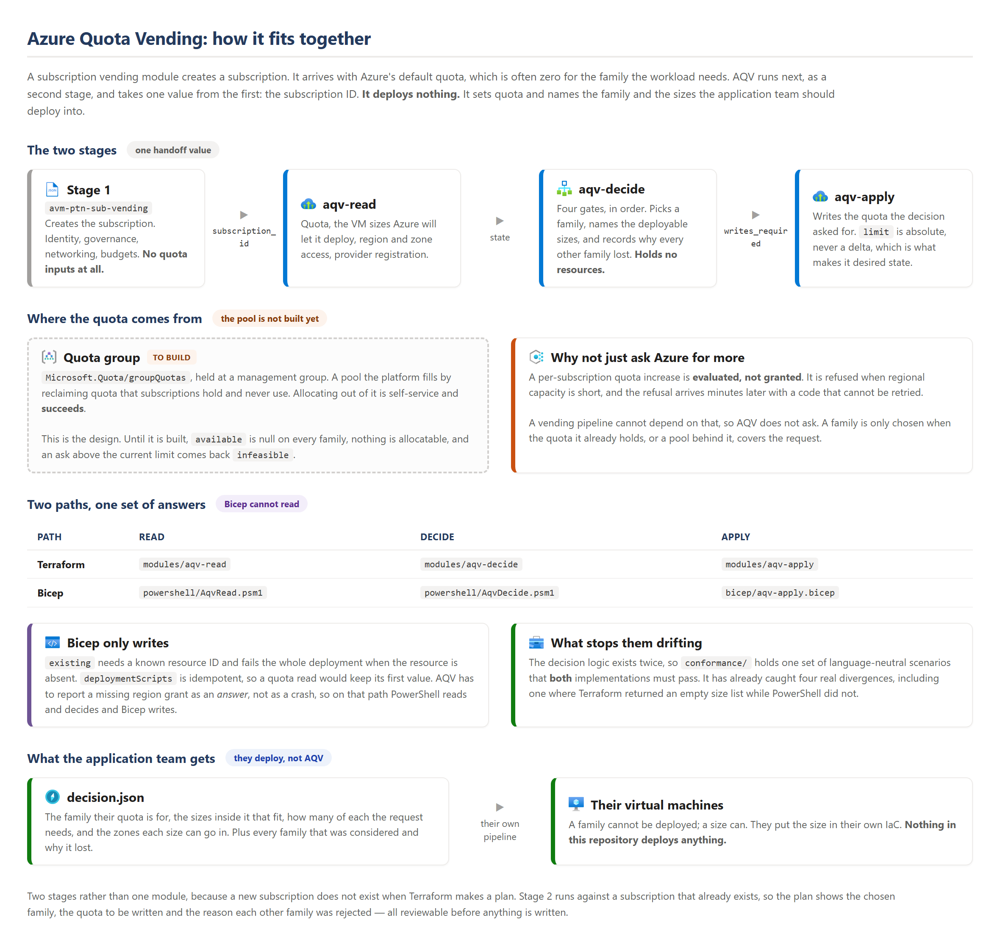

# Stage 2: quota and placement

Microsoft's [subscription vending guidance][vending] describes a pipeline whose
deployment tasks cover **Identity, Governance, Networking, Budgets and
Reporting**. Quota is not among them. CAF names the gap without filling it:

> They should also review the subscription quota limits before creating the
> subscription

> the quota request can fail, so you should run a script to handle any errors

AQV is that script, written as Terraform modules.

## Where it runs

<p align="left">
  
</p>

The quota group in that picture is where the quota is meant to come from: a
pool the platform owns, allocated self-service. **That layer is not built**, so
today `aqv-apply` writes the regional cap and nothing else.

`subscription_id` is the entire handoff contract, and `avm-ptn-sub-vending`
already outputs it. The two stages otherwise share only the parameter file.

The vending module needs no changes — it has no quota inputs and no metadata
passthrough, and with this split it needs neither.

## Why two stages rather than one module

A new subscription does not exist when Terraform makes a plan. A single-stage
module would defer every read until apply. The placement decision would then
never appear in a plan. Run separately, stage 2 plans against a subscription that already
exists: the chosen family, the quota to be written, and why every other family
lost are all visible **before** anything is written.

This also matches the guidance, which recommends a dedicated state file for each
application landing zone subscription. It avoids the provider registration race
as well. Registration completes during stage 1.

## Running it

```bash
terraform init
terraform apply \
  -var subscription_id="$(terraform -chdir=../stage-1 output -raw subscription_id)"
```

Writes are **off by default** so the decision can be reviewed first. Add
`-var apply_writes=true` to let it write quota.

## The subscription request

[`request.example.yaml`](request.example.yaml) is a subscription parameter file in
the guidance's sense — one per request, produced by the request pipeline. Fields
above `compute:` belong to stage 1 and AQV ignores them; `compute:` is what AQV
adds.

The application team states a **workload class**, not an Azure VM family:

```yaml
compute:
  region: eastus
  vcpus: 64
  class: memory_optimized
  placement:
    type: zone_redundant
    zone_count: 3
```

Business rules stay in the module call, not the subscription request — they belong to the
platform team, not the requester.

## What a decision looks like

`request.example.yaml` asks for 64 memory-optimized vCPUs.
`rules.example.yaml` restricts production to three approved families. Run
against a PayAsYouGo subscription whose family limits are all 10:

```text
status      : infeasible
reason      : no candidate family can reach 64 vCPUs
rule applied: production uses approved families, cheapest first
family      : none
writes      : 0
```

That is the correct answer, and it arrives during vending with the reasoning
attached instead of as a failed deployment weeks later. `decision.considered`
carries the two families that were weighed and how far short each one fell.

`summary` is the short version above. `decision` carries the whole answer, and
`writes_required` carries what the apply step would write.

### Family names are case sensitive

`rules.example.yaml` spells each family exactly as Azure returns it. Azure is
not consistent about this: `standardDFamily` is lower case, `StandardDsv6Family`
is not. A name that does not match is absent from the quota, and the decision
comes back `infeasible` with nothing considered.

[vending]: https://learn.microsoft.com/en-us/azure/architecture/landing-zones/subscription-vending
